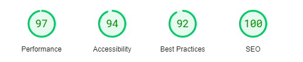
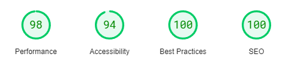
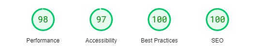

# Battle of the Bulge

This is a website with basic information covering the battle of the bulge also known as the Ardennes Offensive, which was the last major German offensive campaign on the Western Front during World War II. The battle lasted from 16 December 1944 to 28 January 1945, towards the end of the war in Europe.

This is where the idea for Battle of the Bulge comes from. An educational need to provide basic information for anyone who is unfamilar with the battle and historical facts surrounding this event.

People can use the Battle of the Bulge to find historical information such as where it took place, who was involved. Users will also be able to navigate away from the Home page, to a gallery of fun pictures, and then to a timeline page to get even more information on the timeline of events. 

The project was created using HTML and CSS and JavaScript. 

---
## Site Features

* **Title**
The Battle of the Bulge title is styled using Oswald font in a brow and is position to the center with a beige background color and a green border. The title (header) is positioned and styled the same way across all 3 pages.
The footer is styled with a green background color and white font color. There is no font using on the header, this has been styled to use social network link images. This footer is also used across all pages to maintain the consistency for the user. 

* **Navigation**
The navigation menu is located at the top of the page underneath the header and image in the center of the screen.
* 'Home' which is where the overview information is located, that a user will want to see first as a priority.
* 'Timeline' this page is where a more detailed timeline of events is located for the user to get more information. 
* 'Gallery' which shows multiple images from world war 2.

* **Footer**
The footer contains social media links styled with images of the major social media companies.
If a user clicks on one of the social media icons a new webpage will open and be linked to the homepage of the corresponding social media platform. 

* **Color Scheme**

---
* **Header**
The header contains a simple title, and also consists of the navigation menu and an image from WW2. 

* **Summary (mid-page) Section**
The summary section contains a brief on the battle and then a section informaing the user about the participants of the battle.

* **Video (mid-page) Section**
The video section contains an imbedded video for the user to watch to get more information on the battle.

---
* **Timeline Page**

The timeline page contains a summary of events of the battle for users to follow as well as some images that relate to to the timeline.

---
* **Gallery Page**

The Gallery Page when navigated to shows images from world war 2. 

---
* **Testing**
* This webpage has been tested, and works on different explorers such as Chrome, and FireFox.
* This project is responsive and has been designed to work on larger screens as well as small screens, using dev tools it has been tested on iphone screens, ipad screens, as well as other tablets. 
* All text is written and easy to understand

### Testing of Home page

### Testing of Timeline page

### Testing of Gallery Page

## Validator testing

*html
All code and pages have been checked through the W3C Markup Validation Service. The 1st error that came back was for a lack of opening p element in the index file, the checker expected to see an opening element after finding a closing element which was there btu it didnt see.
The 2nd error was an illegal character on the gallery page which was a space.

*css
All css code has been run through the W3C CSS Validation Service and has been passed with no errors found. 

* **Bugs**
All bugs for the webpage have been fixed. 

* **Bug Fixes**
* in the gallery page there were issues with the images placing directly nxt to each other, padding was introduced to seperate.
* the navigation menu when on smaller screens would have the "timetable" link would disapear off screen, text sizing and text spacing was reduced to allow this to be visisble.

---
## Launch and Deployment
* In the GitHub repository, navigate to the Settings tab.  
* Scroll down to the GitHub Pages section and click the 'Check it out here!' link.  

* The project has been created using gitpod and deployed using GitHub, the link for the live page is (https://ddrobrien.github.io/Millie-Cares/)

---

## Future Features

* This page can have a further video added to bottom of home page.
* A map of the site of the battle
* A list of museums for planning a visit to the battle site
---

## Credits

### Content
* The layout of the webpage came from inspiration of the CI [Love Running Project](https://ddrobrien.github.io/Love-Running/)
* Inspiration for both the gallery and sign up came from the CI [Love Running Project](https://ddrobrien.github.io/Love-Running/)
* The code for the navigation menu came from CI [Love Running Project](https://ddrobrien.github.io/Love-Running/)
* The font came from [google font](https://fonts.google.com/)
* Color palette inspiration came from [coolers.co](https://coolors.co/)
* html validation came from [W3C Markup Validation Service](https://validator.w3.org/#validate_by_input)
* css validation came from [W3C CSS Validation Service](https://jigsaw.w3.org/css-validator/)
icons inspiration came from [Love Runnning Project] but sourced from [Font Awesome](https://fontawesome.com/)
* The video was sourced from [History Uk](https://www.history.co.uk/)